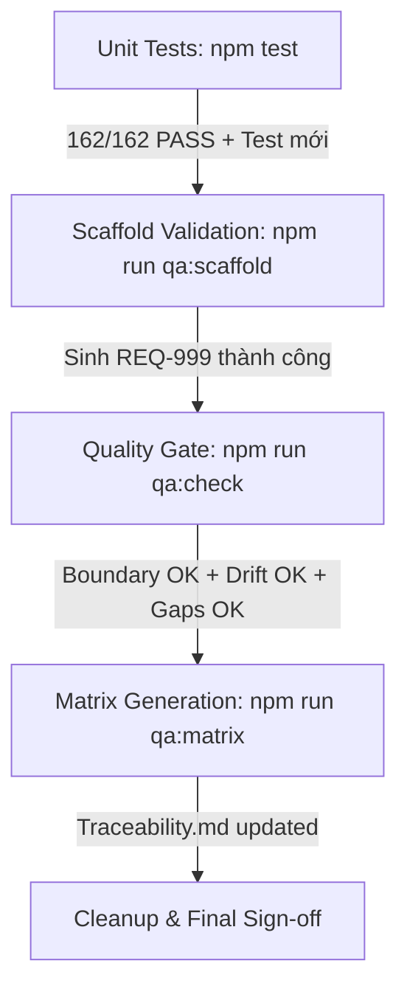

# PLAN 10: QA TRACEABILITY & LIVING DOCUMENTATION ENHANCEMENT

> **Phiên bản:** 1.0 — Ngày khởi tạo: 2026-09-21  
> **Phân loại triển khai:** L3 — Nâng cấp công cụ lõi QA, mở rộng tính năng phân tích và cải thiện Developer Experience (DX).  
> **Vị trí áp dụng:** Bộ khung `Support_doc_n_TestCase` (`d:\_Script_automation`) và Hub (`d:\_Automation-Project`).  
> **Mục tiêu chất lượng:** 100% Zero-Dependency Node.js core, toàn bộ unit test PASS, không phá vỡ ranh giới Hub - Satellite (`sync-manifest.json`).

---

## 1. Bối cảnh & 5 Nhược điểm Cốt tử Cần Khắc phục

Hệ thống **Doc & Script Automation** thiết lập chuỗi truy vết:  
$$\text{Requirement (Nghiệp vụ)} \longrightarrow \text{Acceptance Criteria (AC)} \longrightarrow \text{Test Case (Thiết kế)} \longrightarrow \text{Playwright Script (Mã tự động)}$$

Tuy nhiên, thực tế vận hành chỉ ra 5 điểm nghẽn nghiêm trọng:

| STT | Nhược điểm nhận diện | Nguyên nhân kỹ thuật | Hậu quả thực tế |
| :--- | :--- | :--- | :--- |
| **01** | **Ảo tưởng chất lượng (False Positive)** | `tools/qa` chỉ khớp nối mã thẻ và title, không kiểm tra ruột file test có `expect()` hay không. | Test script rỗng hoặc chỉ mở trang rồi bỏ đó vẫn được báo cáo là **100% Covered**. |
| **02** | **Rào cản tốc độ & Nhiêu khê (Process Overhead)** | Phải copy và gõ tay 3 file riêng biệt (`requirements/`, `test-cases/`, `playwright/`). | Tester nản khi phải làm tính năng gấp (hotfix/agile), dẫn đến bỏ bê tài liệu. |
| **03** | **Dễ gãy vì cú pháp (Strict Convention Fragility)** | Phụ thuộc hoàn toàn vào việc gõ đúng regex `TC-xxx - AC-xxx` và tag `@REQ-xxx`. | Gõ nhầm 1 ký tự (`TC_01`) làm test biến mất khỏi báo cáo hoặc CI chặn merge PR. |
| **04** | **Thiếu độ phủ phân nhánh (Sub-branch Gaps)** | Một AC có nhiều giá trị biên nhưng chỉ map 1 TC duy nhất. | Báo cáo xanh nhưng thực tế bỏ sót các ca kiểm thử biên (Boundary Value Analysis). |
| **05** | **Xung đột Git trên file tổng (Merge Conflicts)** | Nhiều tester cùng sửa chung file `test-cases/traceability.md`. | Kẹt PR, mất thời gian giải quyết conflict thủ công trong Git. |

---

## 2. Ranh giới & Nguyên tắc Bất biến (Architectural Guardrails)

1. **Zero External Dependency:** Toàn bộ công cụ trong `tools/` chạy bằng Node.js core thuần (`node >= 18`), không cài thêm bất kỳ npm package nào vào root `package.json`.
2. **Hub - Satellite Contract:**
   - Các công cụ phân tích chung (`tools/qa`, `tools/boundary`, `tools/scaffold`) và mẫu (`templates/`) thuộc nhóm **`ship`** (Hub sở hữu, ghi đè đồng bộ xuống các repo con).
   - Tài liệu nghiệp vụ (`requirements/`, `test-cases/`, `playwright/tests/pages/`, `data/`) thuộc nhóm **`own`** (Dự án sở hữu độc quyền, Hub cấm đụng đến).
3. **Fail-Closed, Not Fail-Open:** Mọi phát hiện bất thường về dữ liệu (thiếu file, cú pháp lạ, 0 assertion) phải được báo thành **Finding** rõ ràng, không được im lặng bỏ qua.

---

## 3. Chi tiết Các Giai đoạn Triển khai (Phased Execution)

### Phase 1: Công cụ Scaffold Tự động & Reverse Engineering (Giải quyết Nhược điểm #2)

* **Mục tiêu:** Giảm thời gian tạo tài liệu từ 15 phút xuống 5 giây bằng 1 dòng lệnh CLI.
* **Các file thực hiện:**
  * `[NEW]` [`tools/scaffold/index.js`](file:///d:/_Script_automation/tools/scaffold/index.js):
    * **Chế độ 1 - Forward:** `node tools/scaffold --req REQ-xxx --slug <slug> --title "<Tên tính năng>" --acs <số_lượng>`
      * Tự sinh `requirements/REQ-xxx-<slug>.md` (kèm bảng rules, ac headings).
      * Tự sinh `test-cases/REQ-xxx-<slug>.md` (kèm bảng Traceability ánh xạ sẵn).
      * Tự sinh `playwright/tests/<domain>/<slug>.spec.ts` (kèm describe `@REQ-xxx`, blocks `TC-xxx - AC-xxx`).
    * **Chế độ 2 - Reverse:** `node tools/scaffold --infer <đường_dẫn_spec>`
      * Đọc AST/Regex của spec file có sẵn, trích xuất title, describe tag và sinh ra cặp file nháp `requirements/` và `test-cases/` có gắn nhãn `Inferred from automation`.
  * `[NEW]` [`tools/scaffold/index.test.js`](file:///d:/_Script_automation/tools/scaffold/index.test.js):
    * Unit test bao phủ các kịch bản tạo mới, kiểm tra cờ `--force`, kiểm tra tính toàn vẹn của front-matter sinh ra.

---

### Phase 2: Bịt Lỗ hổng Ảo tưởng Chất lượng (Anti-False-Positive Engine - Giải quyết Nhược điểm #1)

* **Mục tiêu:** Không cho phép test rỗng hoặc test thiếu assertion vượt qua cổng kiểm soát chất lượng.
* **Các file thực hiện:**
  * `[MODIFY]` [`tools/qa/lib/sources.js`](file:///d:/_Script_automation/tools/qa/lib/sources.js):
    * Bổ sung hàm quét tĩnh file spec: Đếm số lượng biểu thức `expect(` hoặc `expect.soft(` trong phạm vi từng block test.
    * Nhận diện các test bị `test.skip` hoặc `test.fixme` mà không có tag `@wip`.
    * Trả về thông tin: `{ assertionCount, isSkipped, isWip }`.
  * `[MODIFY]` [`tools/qa/lib/commands.js`](file:///d:/_Script_automation/tools/qa/lib/commands.js):
    * Bổ sung finding mới vào lệnh `gaps` và `drift`:
      * `spec-thieu-assertion` (Mức: `major`): Script có mặt trong bảng traceability nhưng `assertionCount === 0`.
      * `test-bi-skip-am-tham` (Mức: `major`): Script bị skip trong mã nguồn nhưng không có lý do quarantine hợp lệ.
  * `[MODIFY]` [`playwright/eslint.config.mjs`](file:///d:/_Script_automation/playwright/eslint.config.mjs):
    * Siết chặt rule `'playwright/expect-expect': 'error'` và `'playwright/no-skipped-test': 'error'` để IDE báo lỗi ngay khi tester gõ code.

---

### Phase 3: Developer Experience (DX) & Chống Gãy Cú pháp (Giải quyết Nhược điểm #3)

* **Mục tiêu:** Loại bỏ lỗi gõ sai chính tả / format; cung cấp gợi ý sửa lỗi thông minh ngay trên terminal.
* **Các file thực hiện:**
  * `[NEW]` [`.vscode/qa-traceability.code-snippets`](file:///d:/_Script_automation/.vscode/qa-traceability.code-snippets):
    * Cung cấp các phím tắt trong IDE:
      * `req-doc`: Bung nhanh khuôn Requirement Markdown hợp lệ.
      * `tc-doc`: Bung nhanh khuôn Test Case kèm bảng Traceability.
      * `pw-spec`: Bung nhanh file spec Playwright chuẩn TypeScript với tag `@REQ-xxx` và `TC-xxx - AC-xxx`.
  * `[MODIFY]` [`tools/qa/index.js`](file:///d:/_Script_automation/tools/qa/index.js) & [`tools/qa/lib/commands.js`](file:///d:/_Script_automation/tools/qa/lib/commands.js):
    * Nâng cấp bộ Smart Suggestions: Khi phát hiện mã sai quy ước (như `AC-1`, `AC_012`, `tc-01`), lệnh CLI in ra hướng dẫn sửa trực quan (VD: `👉 Gợi ý: Đổi thành 'AC-001'`).

---

### Phase 4: Phân tích Chi tiết Độ phủ Quy tắc & Giá trị Biên (Giải quyết Nhược điểm #4)

* **Mục tiêu:** Phát hiện các Acceptance Criteria có nhiều quy tắc biên nhưng chưa được chia nhỏ test case.
* **Các file thực hiện:**
  * `[MODIFY]` [`tools/qa/lib/commands.js`](file:///d:/_Script_automation/tools/qa/lib/commands.js):
    * Trong lệnh `gaps`, duyệt sâu bảng `## Rules and validation`:
      * Nếu dòng rule có khai báo cột `Boundary` hoặc `Invalid` mà cột `Test cases` chỉ có 1 mã TC duy nhất gánh toàn bộ, bắn cảnh báo `rule-thieu-boundary-test` (Mức: `minor/major`).
      * In khuyến nghị: *"Dòng rule [X] có giá trị biên [Y], nên tách thêm 1 TC để kiểm thử độc lập"*.
  * `[MODIFY]` [`templates/test-case-template.md`](file:///d:/_Script_automation/templates/test-case-template.md):
    * Bổ sung checklist hướng dẫn phân tách TC: 1 Happy Path + 1 Boundary Min + 1 Boundary Max + 1 Negative Error.

---

### Phase 5: Tự động hóa Ma trận Đối chiếu (Anti-Git Conflict - Giải quyết Nhược điểm #5)

* **Mục tiêu:** Không còn ai phải sửa tay file ma trận tổng; loại bỏ 100% nguy cơ merge conflict trên tài liệu.
* **Các file thực hiện:**
  * `[MODIFY]` [`tools/qa/lib/commands.js`](file:///d:/_Script_automation/tools/qa/lib/commands.js) & [`tools/qa/index.js`](file:///d:/_Script_automation/tools/qa/index.js):
    * Bổ sung lệnh `node tools/qa matrix`: Quét toàn bộ `requirements/` và `test-cases/`, tự động tổng hợp và ghi đè ra file [test-cases/traceability.md](file:///d:/_Script_automation/test-cases/traceability.md).
    * Thêm header ghi rõ: `<!-- AUTO-GENERATED FILE. DO NOT EDIT MANUALLY. Run: npm run qa:matrix -->`.
  * `[MODIFY]` [`package.json`](file:///d:/_Script_automation/package.json):
    * Thêm script: `"qa:matrix": "node tools/qa matrix"`, `"qa:scaffold": "node tools/scaffold"`.
  * `[MODIFY]` [`sync-manifest.json`](file:///d:/_Script_automation/sync-manifest.json):
    * Khai báo `tools/scaffold` và `.vscode` vào nhóm `ship`.

---

## 4. Kế hoạch Kiểm thử & Tiêu chuẩn Nghiệm thu (Verification & Gate Criteria)

1. **Gate 1 - Unit Test Suite:** Chạy `npm test` ở thư mục gốc. Toàn bộ 162 unit test hiện tại cộng với các unit test mới của `scaffold` và `matrix` phải **PASS 100%**.
2. **Gate 2 - Scaffolding Test:** Tạo thử 1 tính năng giả định `REQ-999`, kiểm tra `npm run qa:coverage` nhận diện đúng 100%, sau đó xóa dọn dẹp sạch sẽ.
3. **Gate 3 - Strict Quality Gate:** Chạy `npm run qa:check` (chế độ strict). Hệ thống phải đạt:
   * `tools/boundary --strict`: 0 lỗi ranh giới.
   * `tools/qa drift --strict`: 0 drift.
   * `tools/qa gaps --strict`: 0 gap blocker/major.
4. **Gate 4 - Hub Synchronization Safety:** Kiểm tra `sync-manifest.json` khớp hoàn toàn với cấu trúc repo thực tế.

---

## 5. Phân công & Lộ trình Thực hiện

* **Bước 1:** Cập nhật `sync-manifest.json` và `package.json`.
* **Bước 2:** Xây dựng module `tools/scaffold` và viết test `tools/scaffold/index.test.js`.
* **Bước 3:** Nâng cấp `tools/qa/lib/sources.js` và `tools/qa/lib/commands.js` (Assertion checks, Rule boundary gaps, Smart suggestions, Matrix command).
* **Bước 4:** Bổ sung `.vscode/qa-traceability.code-snippets` và tinh chỉnh `playwright/eslint.config.mjs`.
* **Bước 5:** Chạy toàn bộ test suites và kiểm tra nghiêm ngặt `npm run qa:check`.
