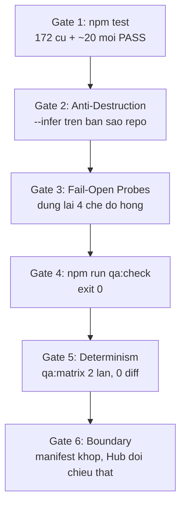

# PLAN 11: SỬA SCAFFOLD & BỊT CÁC CỔNG FAIL-OPEN

> **Phiên bản:** 1.0 — Ngày khởi tạo: 2026-09-21
> **Phân loại triển khai:** L2 — Sửa lỗi mất dữ liệu, bịt fail-open ở cổng chất lượng, trả nợ Plan 10.
> **Vị trí áp dụng:** `d:\_Script_automation` (`tools/scaffold`, `tools/qa`, `tools/boundary`, CI).
> **Mục tiêu chất lượng:** Zero-Dependency Node core, unit test PASS 100%, `npm run qa:check` xanh, không phá ranh giới `sync-manifest.json`.
> **Tiền đề:** [Plan 10](10_QA_TRACEABILITY_AND_FRAMEWORK_ENHANCEMENT_PLAN.md) đã triển khai xong. Plan này sửa phần Plan 10 làm dở hoặc làm sai.

---

## 1. Bối cảnh — kết quả rà soát 2026-09-21

Toàn bộ cổng đang **xanh**: 172/172 unit test PASS, `qa:gaps` / `qa:drift` / `boundary` 0 finding,
`npm run verify` PASS. Nhưng rà soát bằng cách dựng lại các chế độ hỏng cho thấy một phần màu
xanh đó là **xanh giả** — đúng loại lỗi mà Nguyên tắc 3 của Plan 10 ("Fail-Closed, Not Fail-Open")
được viết ra để chống.

| # | Lỗi | Bằng chứng đã dựng lại | Mức |
| :--- | :--- | :--- | :--- |
| **F-01** | `scaffold --infer` **ghi đè chính file spec nó đọc**, không cần `--force`, và báo là `"created"` | `login.spec.ts` 5091 bytes → 3255 bytes placeholder; `TC-013` biến mất | **BLOCKER** |
| **F-02** | `--infer` **bịa ánh xạ TC↔AC** dù đã parse đúng | Thật: `TC-003→AC-002`, `TC-013→AC-001`. Sinh ra: `TC-003→AC-003`, không có TC-013. 5/7 dòng sai | **BLOCKER** |
| **F-03** | Trùng mã REQ thổi phồng độ phủ, không rule nào bắt | 2 file cùng `id: REQ-001` → `coverage` in `2 requirement · 14 AC` | **MAJOR** |
| **F-04** | `tools/boundary` fail-open đúng chỗ nó tự cảnh báo | Bỏ hết `hubModule` → in `OK Đối chiếu Hub`, `--strict` exit 0 | **MAJOR** |
| **F-05** | `rule-thieu-boundary-test` là code chết — nợ của Plan 10 Phase 4 | Chỉ bật qua `options.checkBoundaryRules`; `config.js` **ném lỗi** nếu khai khoá này | **MAJOR** |
| **F-06** | CI không chạy 172 unit test của `tools/` | `playwright.yml` không có `npm test` | **MAJOR** |
| **F-07** | `traceability.md` sinh tự động nhưng churn + không ai kiểm | Chạy 2 lần → diff 1 dòng timestamp; CI không kiểm freshness | **MEDIUM** |
| **F-08** | Output của `scaffold` làm `qa:check` đỏ ngay lập tức | `REQ-902` mới sinh → `major:requirement-draft-nhung-da-co-script` → exit 1 | **MEDIUM** |
| **F-09** | Spec `scaffold` sinh ra dùng giả assertion, vô hiệu hoá đúng rule Phase 2 vừa xây | `expect(true).toBe(true)` cho `assertionCount = 2` nên `spec-thieu-assertion` không bắn | **MEDIUM** |

### Nguyên nhân gốc

`tools/scaffold` có **6 unit test cho 371 dòng**, trong khi các tool khác có 14–44 test. Nó được
bổ sung ở Plan 10 nhưng không bị soi bằng cùng tiêu chuẩn với phần còn lại.

Tệ hơn, fixture của test `inferFromSpec` dùng spec có ánh xạ **1:1** (`TC-001→AC-001`,
`TC-002→AC-002`) — đúng trường hợp duy nhất mà logic bịa ánh xạ tuần tự cho ra kết quả đúng. Test
được viết khớp với giả định của code thay vì khớp với yêu cầu, nên F-02 sống sót. Và test đó
**không hề assert file spec gốc còn nguyên**, nên F-01 cũng sống sót.

> **Bài học ghi lại:** fixture phải chứa ít nhất một ca lệch khỏi trường hợp thuận lợi nhất.
> Mọi tool có ghi file phải có một test khẳng định *cái gì KHÔNG được đụng tới*.

---

## 2. Ranh giới & Nguyên tắc bất biến

Kế thừa nguyên văn Plan 10 mục 2, bổ sung 3 điều:

4. **Không tool nào được ghi đè file mà người dùng không chủ động chỉ định đích.** Đường dẫn ghi
   trùng đường dẫn đọc là lỗi, không phải tính năng của `--force`.
5. **Một cờ điều khiển hành vi gate phải đến được từ CLI hoặc `qa.config.json`.** Tuỳ chọn chỉ
   unit test set được là code chết, không phải tính năng.
6. **`@wip` là nợ đã khai báo, có theo dõi, không chặn gate.** Theo
   [docs/flaky-test-policy.md](../docs/flaky-test-policy.md): `@wip` bị loại khỏi gate PR nhưng vẫn
   chạy nightly. Vì vậy finding liên quan tới test `@wip` để mức `minor` — vẫn hiện trong báo cáo,
   không làm đỏ `--strict`. Stub **không** gắn `@wip` thì chặn như thường.

---

## 3. Chi tiết các giai đoạn

### Phase 1 — Chặn mất dữ liệu ở `--infer` (F-01, F-02)

* **Mục tiêu:** `--infer` không bao giờ ghi vào thư mục `playwright/`, và bảng traceability nó
  sinh ra phải khớp 100% với ánh xạ có thật trong spec.

* `[MODIFY]` [`tools/scaffold/index.js`](../tools/scaffold/index.js)

  1. **`generateScaffold()` — chốt chặn cuối.** Trước mọi `writeFileSync`, so sánh `path.resolve()`
     của 3 đích ghi với nhau và với mọi đường dẫn đầu vào; trùng thì ném lỗi kèm đường dẫn. Chốt
     này phải nằm ở đây, không phải ở `inferFromSpec`, để mọi caller tương lai đều được bảo vệ.

  2. **`inferFromSpec()` — dừng tái sử dụng `generateScaffold`.** Chế độ reverse sinh **đúng 2
     file** (`requirements/`, `test-cases/`) theo Plan 10 Phase 1. Không sinh spec. Không truyền
     `force: true` xuống bất cứ đâu — `force` của người dùng phải đi thẳng, không bị nâng cấp ngầm.

  3. **Dùng thật `tcMatches` đang bị vứt đi.** Hiện `tcMatches` được parse rồi chỉ lấy `.length`.
     Thay bằng:
     - `links` = danh sách `{ tcId, acId, title }` theo đúng thứ tự xuất hiện trong spec.
     - `acs` = tập `acId` duy nhất, sort tăng dần — đây mới là số AC thật, không phải `tcMatches.length`.
     - Bảng Traceability ghi đúng cặp `(acId, tcId)` đã parse, giữ nguyên mã gốc (kể cả `TC-013`
       nhảy số), cột Spec ghi đường dẫn spec nguồn.
     - Spec không parse được cặp nào → ném lỗi có địa chỉ, **không** im lặng fallback về `acCount = 1`.

  4. **Gắn nhãn nguồn theo Plan 10.** Requirement sinh từ reverse phải có
     `Source: Inferred from automation`, và bảng Evidence để sẵn `Confidence: Low` /
     `Status: Needs confirmation` cho từng AC — đây là nháp suy luận, không phải requirement đã chốt.

  5. **Guard trùng mã REQ.** Trước khi ghi, quét front-matter `id:` của **mọi** file trong
     `requirements/`, không chỉ so tên file. Trùng `id` thì ném lỗi chỉ rõ file đang giữ mã đó.
     Guard hiện tại chỉ so `REQ-001-login.md` nên không thấy `REQ-001-sign-in.md`.

  6. **Xoá biến chết `relSpec`** và sửa dòng `Requirement : requirements/${reqId}.md` trong
     `generateSpecContent` thành đường dẫn có slug cho khớp file thật.

  7. **Cờ gõ sai phải báo lỗi.** `parseArgs` hiện nuốt im lặng mọi cờ lạ; đổi thành ném lỗi như
     [`tools/qa/index.js`](../tools/qa/index.js) và [`tools/boundary/index.js`](../tools/boundary/index.js) đang làm.

* `[MODIFY]` [`tools/scaffold/index.test.js`](../tools/scaffold/index.test.js) — bổ sung tối thiểu 8 test:

  | Test | Khẳng định |
  |---|---|
  | `--infer` không đụng spec nguồn | đọc bytes + hash trước/sau, phải **bằng nhau** |
  | `--infer` chỉ tạo 2 file | `created.length === 2`, không path nào nằm dưới `playwright/` |
  | `--infer` giữ đúng ánh xạ lệch | fixture `TC-003→AC-002` + `TC-013→AC-001` phải ra đúng như vậy |
  | `--infer` giữ mã nhảy số | `TC-013` có trong bảng, không bị đổi thành `TC-007` |
  | `--infer` gắn nhãn Inferred | requirement chứa `Inferred from automation` |
  | `--infer` chặn trùng id REQ | có sẵn `REQ-001-sign-in.md` (`id: REQ-001`) → ném lỗi dù tên file khác |
  | `--infer` spec không có cặp TC-AC | ném lỗi, không tạo file nào |
  | `generateScaffold` chặn ghi đè đường dẫn nguồn | ném lỗi kể cả khi `force: true` |

* **Nghiệm thu:** chạy `node tools/scaffold --infer playwright/tests/auth/login.spec.ts` trên bản
  sao repo → `git diff --exit-code playwright/` phải sạch, và bảng sinh ra khớp từng dòng với
  `grep -o "TC-0[0-9][0-9] - AC-0[0-9][0-9]" playwright/tests/auth/login.spec.ts`.

---

### Phase 2 — Bịt fail-open ở cổng (F-03, F-04)

* **Mục tiêu:** hai chế độ hỏng đang in màu xanh phải chuyển thành finding có địa chỉ.

* `[MODIFY]` [`tools/qa/lib/commands.js`](../tools/qa/lib/commands.js) — thêm vào `gaps()`:

  - `ma-req-trung` (**blocker**): hai file trở lên trong `requirements/` cùng `id`. Message liệt kê
    tất cả file đang giữ mã đó. Không có rule này thì `coverage` cộng dồn AC và **độ phủ trông cao
    hơn thực tế** — đúng trạng thái mà F-01 tạo ra.
  - `ma-tc-trung` (**major**): cùng `tcId` xuất hiện ở hai dòng Traceability khác nhau (khác file,
    hoặc cùng file khác `acId`). Hiện `linksByTc` dùng `Map.set` nên dòng sau **ghi đè im lặng**
    dòng trước.
  - `ma-ac-trung` (**major**): cùng `acId` xuất hiện hai lần trong một requirement.

* `[MODIFY]` [`tools/boundary/index.js`](../tools/boundary/index.js):

  - `main()` đọc `hub.notCompared` — hiện được trả về ở dòng ~239 nhưng **không ai đọc** — và đẩy
    thành problem `khong-doi-chieu-duoc-hub` mức **major**.
  - `printHuman()` không được in `OK Đối chiếu Hub` khi `notCompared`; in cảnh báo nêu rõ "0 mục có
    `hubModule`, không đối chiếu được gì".
  - Sửa nhãn severity: hiện `p.severity === 'blocker' ? 'BLOCKER' : 'MAJOR'` nên `minor` bị in nhầm
    thành `MAJOR`. Thêm nhánh `MINOR`.
  - **Thống nhất ngữ nghĩa `--strict`:** đổi `problems.length > 0` thành "chặn từ mức `major` trở
    lên", khớp với `tools/qa`. Hiện `boundary --strict` đỏ vì một finding `minor`
    (`quet-business-bi-cat-do-qua-sau`), còn `qa --strict` thì không — hai chuẩn trong cùng một lệnh
    `qa:check`.

* `[MODIFY]` `tools/qa/lib/commands.test.js`, `tools/boundary/index.test.js` — test cho từng rule
  mới, **cộng thêm** một test khẳng định `boundary --strict` **exit 0** khi chỉ còn finding `minor`.

---

### Phase 3 — Bật lại phân tích biên (F-05, nợ Plan 10 Phase 4)

* **Mục tiêu:** Nhược điểm #04 của Plan 10 ("Thiếu độ phủ phân nhánh") hiện **chưa được khắc phục**
  — rule có tồn tại nhưng không đường nào bật được nó ở production.

* `[MODIFY]` [`tools/qa/lib/config.js`](../tools/qa/lib/config.js):
  - Thêm `checkBoundaryRules: true` vào `DEFAULTS` — **mặc định bật**, đây là lý do Phase 4 tồn tại.
  - Vòng lặp validate hiện chỉ xử lý `ARRAY_KEYS` và chuỗi, khoá boolean sẽ bị ném lỗi
    `"phải là chuỗi không rỗng"`. Phải thêm `BOOLEAN_KEYS` và nhánh kiểm `typeof value !== 'boolean'`.

* `[MODIFY]` [`tools/qa/index.js`](../tools/qa/index.js):
  - `parseArgs` nhận `--no-boundary-rules` (và `--boundary-rules` cho đối xứng).
  - Truyền `checkBoundaryRules` vào `options` — hiện `options` chỉ có 5 khoá, thiếu đúng khoá này.

* `[MODIFY]` [`tools/qa/lib/commands.js`](../tools/qa/lib/commands.js):
  - Mở rộng điều kiện: hiện chỉ bắn khi `rule.boundary.includes(',')`. Plan 10 nói **"Boundary hoặc
    Invalid"**, nên thêm nhánh: cột `Invalid` liệt kê nhiều giá trị (phân tách bởi `,`) mà chỉ gánh
    1 TC → cũng bắn.
  - Message in kèm gợi ý tách case cụ thể lấy từ `expectedCasesFromRule()`.

* **Tác động đã biết lên repo hiện tại:** bật rule này sẽ làm `qa:gaps` xuất hiện **2 finding
  `minor`** trên [REQ-001](../requirements/REQ-001-sign-in.md) — đúng như mong đợi, không phải hồi quy:

  | Dòng rule | Boundary | Test cases | Thiếu |
  |---|---|---|---|
  | `Email` | `254 ký tự (max), 255` | chỉ `TC-004` | TC-004 chỉ test sai định dạng, không test độ dài |
  | `Password` | `8, 64, 65` | chỉ `TC-012` | 3 giá trị biên gánh bởi 1 TC |

  Mức `minor` nên `qa:check` vẫn xanh. **Việc cần làm kèm theo:** bổ sung TC cho 2 dòng này vào
  [test-cases/REQ-001-sign-in.md](../test-cases/REQ-001-sign-in.md), hoặc ghi lý do vào mục
  "Case không automation".

* `[MODIFY]` [`tools/qa/README.md`](../tools/qa/README.md) — mục "Giới hạn" số **2** hiện mô tả đúng
  cái mà Phase này khắc phục; viết lại cho khỏi lạc hậu.

---

### Phase 4 — Gác chính công cụ gác (F-06, F-07)

* **Mục tiêu:** toàn bộ cổng chất lượng dựa vào `tools/`, mà `tools/` thì không được gác. Và
  `traceability.md` là artifact sinh tự động nhưng không ai kiểm nó có còn mới không.

* `[MODIFY]` [`.github/workflows/playwright.yml`](../.github/workflows/playwright.yml) — job `traceability`,
  thêm 2 bước:

  - **Unit test cho `tools/`:** chạy `npm test` (tức `node --test tools/`). Không cần `npm ci` vì
    root zero-dependency.
  - **Ma trận truy vết phải còn mới:** chạy `node tools/qa matrix` rồi
    `git diff --exit-code test-cases/traceability.md`. Bước này chỉ chạy được sau khi bỏ timestamp ở dưới.

* `[MODIFY]` [`tools/qa/lib/commands.js`](../tools/qa/lib/commands.js) — hàm `matrix()`:
  - **Bỏ dòng timestamp** `Sinh tự động lúc: ...`. Đây đúng là dòng merge-conflict mà Plan 10
    Phase 5 định xoá, nay quay lại dưới dạng khác: chạy 2 lần cách nhau 18 phút đã tạo diff 1 dòng
    dù nội dung không đổi.
  - Giữ banner `AUTO-GENERATED` + câu lệnh tái sinh. Output phải **tất định**: cùng input → cùng bytes.
  - Sửa fail-open: `statusText = link.automation || 'No'` đang dán nhãn `No` (thủ công) cho ô
    automation **hỏng** (`null`). Đổi thành nhãn riêng kiểu `(KHÔNG ĐỌC ĐƯỢC)` để khớp với finding
    `gia-tri-automation-khong-hop-le`.
  - Thống nhất đường dẫn cột Spec: `matrix()` sinh đường dẫn từ gốc repo (`playwright/tests/...`)
    còn bảng nguồn trong `test-cases/` ghi tương đối với `playwright/` (`tests/...`). Chọn **gốc
    repo** cho cả hai, sửa lại bảng nguồn.

* `[MODIFY]` [`.github/copilot-instructions.md`](../.github/copilot-instructions.md) — mục 12 đang bảo
  agent *"Cập nhật `test-cases/traceability.md`"*, mâu thuẫn với banner `DO NOT EDIT MANUALLY` trong
  chính file đó. Đổi thành *"chạy `npm run qa:matrix`, không sửa tay"*.

---

### Phase 5 — Scaffold ra trạng thái trung thực (F-08, F-09)

* **Mục tiêu:** output của `scaffold` phải (a) không nói dối bảng traceability, (b) không vô hiệu
  hoá rule của Plan 10 Phase 2, (c) không làm `qa:check` đỏ bằng một thông điệp sai bản chất.

* **Quyết định thiết kế — vì sao không cố làm cho scaffold "xanh tuyệt đối":** một requirement vừa
  scaffold *đúng là* việc chưa xong; ép nó xanh là quay lại chính ảo tưởng chất lượng mà Plan 10
  chống. Cách đúng là **hiện trong báo cáo (`minor`), không chặn gate (`major+`)**, và thông điệp
  phải nói đúng bản chất.

* `[MODIFY]` [`tools/scaffold/index.js`](../tools/scaffold/index.js) — `generateSpecContent()`:

  - Đổi `test(` thành `test.fixme(` và thêm tag `@wip`.
  - Thay `expect(true).toBe(true)` (**giả assertion**, làm `spec-thieu-assertion` mù) bằng một
    assertion **cố tình đỏ** kiểu `expect(false, 'TODO: viết assertion cho AC-00x').toBe(true)`.
    Đã kiểm chứng ba ràng buộc:
    - `playwright test --list` **vẫn liệt kê** `test.fixme` → không sinh finding
      `khai-automation-nhung-khong-co-script`.
    - `sources.js` nhận diện `isSkipped` qua `/test\.(?:skip|fixme)\b/`, và `test-bi-skip-am-tham`
      đã bỏ qua `@wip` → không bắn.
    - ESLint `playwright/expect-expect` là **error** và sẽ đỏ nếu stub không có assertion nào, nên
      stub bắt buộc phải có đúng 1 assertion. `expect(false)` là lựa chọn vừa qua lint vừa trung
      thực: ai gỡ `fixme` mà chưa viết test thì test đỏ ngay.
  - Gate PR chạy `--grep-invert @wip` nên stub không lọt vào CI của PR; nightly chạy nhưng `fixme`
    chỉ báo skipped.

* `[MODIFY]` [`tools/scaffold/index.js`](../tools/scaffold/index.js) — `generateTestCaseContent()`:

  - Cột `Automation` ghi `Candidate` (không phải `Yes`) và `Priority` để `P2` cho mọi dòng. Ghi
    `Yes` cho một stub `fixme` là nói dối bảng traceability; `Candidate` + `P2` đồng thời tránh
    rule `p0-p1-con-dang-candidate`.
  - Thêm dòng nhắc QA đặt lại priority thật ngay dưới bảng.

* `[MODIFY]` [`tools/qa/lib/commands.js`](../tools/qa/lib/commands.js):

  - `drift()` — `requirement-draft-nhung-da-co-script`: **hạ xuống `minor`** và đổi thành
    `requirement-moi-scaffold-chua-hoan-thien` **khi mọi test trỏ vào REQ đó đều mang `@wip`**. Giữ
    nguyên `major` khi có test không `@wip` — đó mới là "script đang test hành vi chưa chốt". Hiện
    rule bắn `major` cho mọi REQ `Draft` có script, nên `REQ-902` vừa scaffold đã làm `qa:check`
    exit 1 bằng một thông điệp sai bản chất.
  - `gaps()` — thêm `ac-chi-co-script-wip` (**minor**): AC có test case, nhưng **mọi** spec khớp đều
    `@wip`. Không có rule này thì stub `fixme` được `coverage` tính là đã automation — một fail-open
    **mới** do chính Phase này tạo ra.
  - `coverage()` — thêm ô `wip: []` vào mỗi row và in cột riêng, để stub không nằm lẫn trong `automated`.

* `[MODIFY]` [`tools/scaffold/index.js`](../tools/scaffold/index.js) — `main()`: sau khi sinh, in ra
  **chính xác** finding mà `qa:gaps` / `qa:drift` sắp báo và vì sao đó là bình thường, kèm 3 việc
  tiếp theo. Người dùng không nên phải tự đoán vì sao báo cáo vừa đổi màu.

* `[MODIFY]` [`tools/scaffold/index.js`](../tools/scaffold/index.js) — **tôn trọng `qa.config.json`:**
  hiện hard-code `'requirements'`, `'test-cases'`, `'playwright'`, bỏ qua `requirementsDir` /
  `testCasesDir` / `projectDir`. Import `loadConfig()` từ
  [`tools/qa/lib/config.js`](../tools/qa/lib/config.js) — nếu không thì scaffold phá đúng tính di động
  mà config sinh ra để phục vụ.

---

### Phase 6 — Dọn lệch nhỏ & tài liệu

| Việc | File |
|---|---|
| Đối chiếu cột `Spec` với filesystem; trỏ file không tồn tại → finding `major` | `tools/qa/lib/commands.js` |
| `no-skipped-test` lên `'error'` theo Plan 10 Phase 2, **hoặc** thêm `--max-warnings=0` vào script `lint`. Đã kiểm: `test.skip` toàn bộ file hiện cho `lint` exit **0** | `playwright/eslint.config.mjs`, `playwright/package.json` |
| Thay byte ESC thô bằng `\u001b` cho khớp 2 tool kia | `tools/decisions/index.js:26` |
| `impact` gộp trùng tên file thay vì in 7 dòng cùng một file | `tools/qa/index.js` — `runImpact` |
| Bổ sung `qa:matrix`, `qa:scaffold`, `decisions`, `npm test` vào bảng lệnh — 4/8 lệnh gốc đang vô hình | [`README.md`](../README.md), [`CLAUDE.md`](../CLAUDE.md) |
| Xoá dòng "chưa assert thuộc tính cookie" — `TC-013` đã assert rồi | `requirements/REQ-001-sign-in.md`, mục *Gaps found from automation* |
| Ghi chú `Secure` / `SameSite` không đúng trên `http://localhost` — đang là `expect.soft` nên không chặn, nhưng sẽ báo fail trên mọi môi trường http | `playwright/tests/auth/login.spec.ts` — TC-013 |
| Ghi rõ job `e2e` sẽ fail tới khi cấu hình `BASE_URL` trỏ môi trường thật (config không có `webServer`) | `README.md`, mục CI |

---

## 4. Kiểm thử & Tiêu chuẩn nghiệm thu

**Gate 1 — Unit test.** `npm test` ở gốc. 172 test hiện có PASS + tối thiểu 20 test mới (8 scaffold,
6 rule trùng mã, 3 boundary, 3 matrix/`@wip`). Không được sửa test cũ cho vừa code mới, trừ khi hành
vi cũ chính là lỗi — sửa thì ghi lý do vào commit message.

**Gate 2 — Anti-Destruction (bắt buộc, chống tái phát F-01).** Trên một bản sao repo:

- chạy `node tools/scaffold --infer playwright/tests/auth/login.spec.ts`
- `git diff --exit-code playwright/` phải sạch
- bảng sinh ra khớp từng dòng với `grep -o "TC-0[0-9][0-9] - AC-0[0-9][0-9]" playwright/tests/auth/login.spec.ts`

**Gate 3 — Fail-Open Probes.** Dựng lại đúng 4 kịch bản đã dùng khi rà soát; mỗi cái phải sinh
finding, không được im lặng:

| Kịch bản | Kỳ vọng sau khi sửa |
|---|---|
| Copy `REQ-001-sign-in.md` thành file thứ hai cùng `id` | `blocker: ma-req-trung` |
| Bỏ hết `hubModule` khỏi `sync-manifest.json` | `major: khong-doi-chieu-duoc-hub`, `--strict` exit 1 |
| `scaffold --req REQ-902` rồi chạy `qa:check` | exit **0**, `qa:gaps` hiện `minor` về stub `@wip` |
| Bật `checkBoundaryRules` trên REQ-001 | 2 finding `minor` (Email, Password) |

**Gate 4 — Strict Quality Gate.** `npm run qa:check` exit 0 trên repo thật, sau khi đã xử lý 2
finding `minor` của Phase 3.

**Gate 5 — Determinism.** `node tools/qa matrix` hai lần liên tiếp →
`git diff --exit-code test-cases/traceability.md` sạch.

**Gate 6 — Hub Safety.** `node tools/boundary --strict` exit 0, và phần đối chiếu Hub in ra
`FORBIDDEN_SYNC_MODULES` thật, không phải nhánh `notCompared`.

> **Lưu ý khi sync:** `tools/qa`, `tools/boundary`, `tools/scaffold`, `.github/copilot-instructions.md`
> đều thuộc nhóm **`ship`** — sửa ở đây rồi phải đẩy ngược lên Hub, nếu không lần sync sau sẽ bị ghi
> đè. Xem [docs/hub-and-project-boundary.md](../docs/hub-and-project-boundary.md).

---

## 5. Lộ trình

| Bước | Nội dung | Phase | Chặn gì nếu bỏ |
| :--- | :--- | :--- | :--- |
| 1 | Chốt chặn ghi đè + guard trùng id trong `scaffold` | 1 | Mất code thật. **Làm trước tiên.** |
| 2 | Viết lại `inferFromSpec` dùng `tcMatches` thật | 1 | Traceability sai mà trông đúng |
| 3 | Rule trùng mã REQ / TC / AC | 2 | Độ phủ thổi phồng |
| 4 | `notCompared` + nhãn severity + thống nhất `--strict` của boundary | 2 | Hub ghi đè business mà CI im |
| 5 | Bật `checkBoundaryRules` qua config + CLI | 3 | Nợ Plan 10 Phase 4 |
| 6 | `npm test` + kiểm freshness matrix vào CI | 4 | Công cụ gác không ai gác |
| 7 | Bỏ timestamp `matrix()`, thống nhất đường dẫn cột Spec | 4 | Bước 6 không chạy được |
| 8 | Scaffold ra `fixme` + `@wip` + `Candidate`; hạ mức rule Draft; thêm `ac-chi-co-script-wip` | 5 | Scaffold vô dụng vì luôn làm đỏ gate |
| 9 | Dọn vụn vặt + tài liệu | 6 | — |

**Thứ tự bắt buộc:** 1 → 2 (cùng file, bước 2 dựa trên chốt chặn của bước 1) · 7 → 6 (CI không kiểm
được freshness khi output còn timestamp) · các bước 3, 4, 5 độc lập nhau, làm song song được.

**Ước lượng:** Phase 1 nặng nhất — viết lại generator + 8 test. Phase 2–4 mỗi cái một lượt sửa nhỏ
kèm test. Phase 5 cần chạy lại toàn bộ Gate 3 vì nó đụng vào ngữ nghĩa severity.
