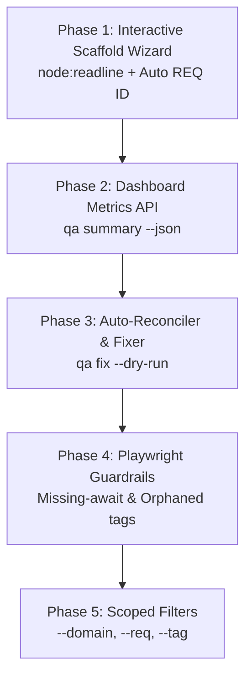
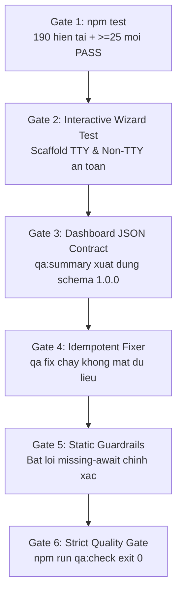

# PLAN 12: INTERACTIVE SCAFFOLD WIZARD, DASHBOARD METRICS API & TRACEABILITY AUTO-RECONCILER

> **Phiên bản:** 1.0 — Ngày khởi tạo: 2026-09-21  
> **Phân loại triển khai:** L2/L3 — Tối ưu hóa trải nghiệm nhà phát triển (DX), Tích hợp Trực quan hóa Dashboard (CarThings Automation Dashboard), Cung cấp Cơ chế Tự động Đồng bộ & Sửa lỗi (Auto-Reconciler / Fixer), và Playwright AST Static Guardrails.  
> **Vị trí áp dụng:** `d:\_Script_automation` (`tools/scaffold`, `tools/qa`, `tools/boundary`, `sync-manifest.json`, `package.json`).  
> **Mục tiêu chất lượng:** 100% Zero-Dependency Node.js core, toàn bộ unit tests PASS (190 hiện có + 25-30 tests mới), không phá vỡ ranh giới Hub-Satellite (`sync-manifest.json`), chuẩn hóa schema cho Dashboard.  
> **Tiền đề:** [Plan 10](10_QA_TRACEABILITY_AND_FRAMEWORK_ENHANCEMENT_PLAN.md) và [Plan 11](11_FIX_SCAFFOLD_AND_CLOSE_FAIL_OPEN_GATES_PLAN.md) đã hoàn thành xuất sắc (190/190 tests PASS, fail-open gates đã được bịt kín).

---

## 1. Bối cảnh & Cơ hội Cải tiến (Post Plan 11 Review)

Sau khi hoàn thành Plan 11, toàn bộ các lỗ hổng fail-open, nguy cơ mất dữ liệu ở scaffold và tính bất định của ma trận đã được xử lý triệt để. Hệ thống hiện có:
- **190 unit test PASS 100%** bao phủ từ parsing, join, boundary, decisions đến scaffold.
- Ranh giới Hub-Project được kiểm soát chặt chẽ với cơ chế đối chiếu thật.
- Ma trận truy vết byte-deterministic và có kiểm tra freshness trên CI.

Tuy nhiên, khi mở rộng framework cho toàn đội ngũ tester và tích hợp sâu với **CarThings Automation Dashboard** (đang chạy tại `http://127.0.0.1:4174`), xuất hiện 5 rào cản về Trải nghiệm Nhà phát triển (DX) và Tích hợp Tự động hóa:

| # | Điểm nghẽn thực tế | Phân tích kỹ thuật | Tác động |
| :--- | :--- | :--- | :--- |
| **G-01** | **Scaffold CLI cồng kềnh, dễ gõ sai** | Người dùng phải nhớ chuỗi cờ dài (`--req`, `--slug`, `--title`, `--acs`, `--domain`). Chạy trần `node tools/scaffold` chỉ in usage rồi thoát. Phải tự đếm REQ ID kế tiếp bằng tay. | Rào cản tâm lý cho tester mới, dễ trùng mã hoặc đặt tên không nhất quán. |
| **G-02** | **Thiếu API Metrics tổng hợp cho Dashboard** | CarThings Dashboard (Port 4174) hiện chỉ đọc trực tiếp `decisions.json`. Muốn hiển thị widget QA Health phải parse thủ công stdout của nhiều lệnh CLI khác nhau. | Dashboard thiếu thẻ trực quan hoá tiến độ Automation, Coverage %, và Findings. |
| **G-03** | **Sửa lỗi Traceability hoàn toàn thủ công** | Khi đổi tên spec, di chuyển file hoặc thêm test case mới vào code, `qa:drift` báo lỗi đường dẫn hoặc test mồ côi. Tester phải tự mở `test-cases/<req>.md` tìm từng dòng Markdown để sửa tay. | Tốn công sức cơ học, dễ tạo merge conflict hoặc typo trong Markdown table. |
| **G-04** | **Lỗi ngầm Playwright: Quên `await expect(...)`** | Viết `expect(locator).toBeVisible()` mà quên `await` là lỗi kinh điển trong async Playwright. Promise không được await khiến test pass ảo nhưng sinh ra flaky test ngẫu nhiên. | Báo cáo xanh nhưng test script thực chất vô hiệu hóa assertion. |
| **G-05** | **Thiếu khả năng lọc theo Domain / Feature Scope** | Mọi lệnh `coverage`, `drift`, `gaps`, `matrix` luôn quét toàn bộ repo. Khi repo lên tới 50+ REQ và 300+ tests, developer làm PR cho 1 module nhỏ bị ngập trong log của các module khác. | Chậm phản hồi, khó tập trung vào phạm vi công việc của từng Sprint / Feature branch. |

---

## 2. Ranh giới & Nguyên tắc Bất biến (Architectural Guardrails)

Kế thừa toàn bộ các nguyên tắc cốt lõi từ Plan 10 và Plan 11, bổ sung 3 nguyên tắc cho Plan 12:

1. **Zero External Dependency:** Toàn bộ tính năng tương tác (CLI Wizard qua `node:readline`), phân tích AST/Regex, xuất metrics đều sử dụng 100% thư viện chuẩn của Node.js (`node:fs`, `node:path`, `node:readline`, `node:crypto`, `node:test`, `node:assert`). Không cài thêm bất kỳ npm package nào vào root `package.json`.
2. **Safe & Non-Destructive Auto-Fixing (Idempotent Reconciler):** Công cụ `qa fix` chỉ sửa các thông tin có thể suy luận chính xác 100% (chuẩn hóa tiền tố đường dẫn spec, đồng bộ ma trận, đồng bộ mã TC). Phải hỗ trợ cờ `--dry-run` để xem trước thay đổi. Tuyệt đối không xóa nội dung của người dùng. Chạy 1 lần hay $N$ lần phải cho ra cùng một trạng thái (idempotent).
3. **Dashboard Contract Separation:** Dữ liệu xuất cho Dashboard qua `qa summary --json` phải tuân thủ JSON Schema phiên bản cố định (`schemaVersion: "1.0.0"`), tách bạch rõ ràng giữa `metrics`, `health`, `boundary` và `decisions`.

---

## 3. Chi tiết Các Giai đoạn Triển khai (Phased Execution)

### Phase 1: Interactive Scaffold Wizard (`tools/scaffold`) (Giải quyết G-01)

* **Mục tiêu:** Tạo mới bộ tài liệu 3-file trong 10 giây qua giao diện dòng lệnh tương tác thông minh, tự động tính toán ID tiếp theo, đề xuất slug và domain mà không cần nhớ cú pháp cờ.

* `[MODIFY]` [`tools/scaffold/index.js`](../tools/scaffold/index.js):
  1. **Tự động kích hoạt Wizard:**
     - Khi chạy `node tools/scaffold` hoặc `npm run qa:scaffold` không truyền tham số trong terminal tương tác (`process.stdin.isTTY`), hoặc khi có cờ `--wizard` / `-w`.
     - Vẫn giữ nguyên 100% hành vi truyền cờ đầy đủ (`--req`, `--slug`, `--title`, `--acs`, `--domain`) cho CI và non-interactive scripts.
  2. **Hàm `suggestNextReqId(requirementsDir)`:**
     - Quét toàn bộ file trong thư mục `requirements/`, bóc tách front-matter `id: REQ-(\d+)`.
     - Tìm số lớn nhất $N$ và trả về `REQ-` kèm số 0 đệm chuẩn: $\max(N) + 1$ (VD: có `REQ-001` → đề xuất `REQ-002`).
  3. **Hàm `listExistingDomains(projectDir)`:**
     - Quét các thư mục con trong `playwright/tests/` (bỏ qua `support`, `fixtures`, `api`, `pages`, `data`).
     - Trả về danh sách domain hiện có (VD: `['auth', 'a11y']`) để người dùng chọn nhanh bằng số, hoặc nhập domain mới.
  4. **Quy trình hỏi đáp từng bước (sử dụng `node:readline`):**
     - Bước 1: `Mã Requirement [Mặc định: REQ-002]:` (Enter để chọn mặc định).
     - Bước 2: `Tiêu đề tính năng:` (VD: `Quên mật khẩu`).
     - Bước 3: `Slug định danh [Mặc định: quen-mat-khau]:` (Tự sinh từ title qua `slugify()`, cho phép sửa).
     - Bước 4: `Chọn Domain (1. auth, 2. a11y, 3. Nhập mới) [Mặc định: 1]:`.
     - Bước 5: `Số lượng Acceptance Criteria (AC) [Mặc định: 3]:`.
     - Bước 6: `Xác nhận tạo 3 file? (Y/n):` -> In preview đường dẫn 3 file.
  5. **Bảo vệ an toàn:**
     - Tận dụng lại toàn bộ chốt chặn an toàn `generateScaffold` đã xây dựng ở Plan 11 (kiểm tra trùng mã ID, kiểm tra không ghi đè file input).

* `[MODIFY]` [`tools/scaffold/index.test.js`](../tools/scaffold/index.test.js):
  - Test `suggestNextReqId`: thư mục trống trả `REQ-001`; có `REQ-001`, `REQ-005` trả `REQ-006`.
  - Test `listExistingDomains`: lọc đúng các domain nghiệp vụ trong `playwright/tests`.
  - Test wizard fallback an toàn khi `isTTY === false`.

---

### Phase 2: QA Summary & Dashboard Metrics API (Giải quyết G-02)

* **Mục tiêu:** Cung cấp điểm truy cập dữ liệu chuẩn hóa duy nhất (`qa summary --json`) giúp **CarThings Automation Dashboard** (Port 4174) và các công cụ giám sát hiển thị tình trạng sức khỏe QA trong 1 click.

* `[MODIFY]` [`tools/qa/lib/commands.js`](../tools/qa/lib/commands.js):
  1. **Hàm `summary(root, options)`:**
     - Thu thập đồng thời kết quả từ `coverage`, `gaps`, `drift`, `boundary`, và `decisions`.
     - Tính toán các chỉ số cốt lõi:
       - `requirementsCount`: Tổng số requirement đang quản lý.
       - `acsTotal`: Tổng số Acceptance Criteria.
       - `acsCovered`: Số AC đã có automation script (không tính `@wip`).
       - `coveragePercent`: Tỷ lệ phần trăm bao phủ (làm tròn 1 chữ số thập phân).
       - `tcsTotal`: Tổng số Test Case đã thiết kế.
       - `automatedTestsCount`: Số test automation thật.
       - `wipTestsCount`: Số test đang ở trạng thái `@wip` / stub.
       - `findings`: Phân loại `{ blocker, major, minor }` từ cả `gaps` và `drift`.
       - `boundaryStatus`: Trạng thái ranh giới Hub (`ALIGNED` hoặc `DRIFTED`).
       - `pendingDecisions`: Số quyết định trong `decisions.json` chưa có câu trả lời.
     - Xác định trạng thái tổng thể `systemHealth`:
       - `CRITICAL`: nếu có $\ge 1$ Blocker finding hoặc ranh giới bị phá vỡ.
       - `WARNING`: nếu có $\ge 1$ Major finding hoặc còn quyết định `blocking` chưa duyệt.
       - `HEALTHY`: nếu 0 Blocker, 0 Major (chấp nhận Minor).

* `[MODIFY]` [`tools/qa/index.js`](../tools/qa/index.js):
  - Dispatch lệnh mới: `summary`.
  - Cờ hỗ trợ: `--json`, `--output=<filepath>` (ghi kết quả ra file JSON phục vụ static dashboard build).
  - Terminal output: In bảng tóm tắt dạng Box-Drawing Card bắt mắt với màu sắc trực quan (Xanh / Vàng / Đỏ).

* `[MODIFY]` [`package.json`](../package.json):
  - Bổ sung script: `"qa:summary": "node tools/qa summary"`.

* `[MODIFY]` [`tools/qa/lib/commands.test.js`](../tools/qa/lib/commands.test.js):
  - Test `summary`: kiểm tra độ khớp toán học giữa `summary()` và các hàm con `coverage()`, `gaps()`, `drift()`.
  - Test phân loại `systemHealth` chính xác theo từng kịch bản findings.

---

### Phase 3: Traceability Auto-Reconciler & Fixer (`qa fix`) (Giải quyết G-03)

* **Mục tiêu:** Tự động sửa chữa các lỗi lệch pha tài liệu phổ biến mà không cần tester phải mở từng file Markdown gõ tay.

* `[NEW]` [`tools/qa/lib/fixer.js`](../tools/qa/lib/fixer.js):
  1. **Hàm `fixTraceability(root, options)`:**
     - **Tác vụ 1: Chuẩn hóa đường dẫn Spec (Normalize Spec Paths):**
       - Quét tất cả dòng trong `test-cases/*.md`.
       - Nếu cột `Spec` trỏ tới `tests/...` mà trên ổ đĩa file thực tế nằm ở `playwright/tests/...`, tự động bổ sung tiền tố `playwright/` chính xác.
     - **Tác vụ 2: Tự động đăng ký Test Cases mới phát hiện từ Spec (Register Unmapped Tests):**
       - Nếu trong spec Playwright có test mang tag `@REQ-xxx` và mã `TC-yyy - AC-zzz`, nhưng trong bảng Traceability của `test-cases/REQ-xxx.md` chưa có dòng này:
       - Tự động chèn dòng mới vào bảng Traceability với: `| REQ-xxx | AC-zzz | TC-yyy | Candidate | <specPath> | P2 |`.
     - **Tác vụ 3: Đồng bộ Ma trận Tổng (Regenerate Matrix):**
       - Tự động gọi lại `matrix(root, options)` để cập nhật file `test-cases/traceability.md` chuẩn xác.
  2. **Chế độ An toàn (Safe Execution & Idempotence):**
     - Nhận cờ `dryRun: true`: Chỉ trả về danh sách các thay đổi dự kiến (`{ file, line, before, after }`) mà không chạm vào đĩa.
     - Kiểm tra hash nội dung trước và sau; nếu không có gì thay đổi, báo `Không có gì cần sửa`.
     - Chạy nhiều lần liên tiếp không làm sai lệch hay nhân đôi nội dung.

* `[MODIFY]` [`tools/qa/index.js`](../tools/qa/index.js):
  - Dispatch lệnh mới: `fix`.
  - Cờ hỗ trợ: `--dry-run`, `--req=<id>`.
  - In chi tiết từng dòng đã được tự động sửa kèm số dòng và diff màu.

* `[NEW]` [`tools/qa/lib/fixer.test.js`](../tools/qa/lib/fixer.test.js):
  - Test fixer tự chuẩn hóa đường dẫn spec thiếu tiền tố.
  - Test fixer tự bổ sung TC mới phát hiện từ automation vào markdown table.
  - Test cờ `--dry-run` khẳng định file trên đĩa không bị thay đổi.
  - Test tính chất idempotent: chạy 2 lần cho cùng 1 kết quả.

---

### Phase 4: Playwright Static Guardrails & Missing-Await Linter (Giải quyết G-04)

* **Mục tiêu:** Phát hiện tĩnh các lỗi cú pháp Playwright nguy hiểm gây pass ảo hoặc flaky test trước khi code được merge vào main.

* `[MODIFY]` [`tools/qa/lib/sources.js`](../tools/qa/lib/sources.js):
  1. **Nhận diện Missing Await trên Locator Assertions:**
     - Mở rộng hàm quét tĩnh mã nguồn Playwright.
     - Kiểm tra các biểu thức `expect(...)` đi kèm các matcher bất đồng bộ của Playwright (ví dụ: `.toBeVisible()`, `.toBeHidden()`, `.toHaveText()`, `.toContainText()`, `.toBeEnabled()`, `.toBeDisabled()`, `.toHaveValue()`, `.toBeChecked()`, ...).
     - Nếu không có từ khóa `await` đứng trước (trong cùng dòng lệnh statement), đánh dấu cờ `{ missingAwait: true, line: lineNumber }`.
  2. **Nhận diện Orphaned REQ Tags:**
     - Kiểm tra các tag dạng `@REQ-xxx` trong test suite. Nếu mã `REQ-xxx` không khớp với bất kỳ requirement nào trong `requirements/`, gắn cờ orphaned tag.
  3. **Nhận diện Unlabeled Tests dưới `@REQ` Block:**
     - Khi một `test.describe('... @REQ-xxx', ...)` chứa các block `test('...')` con mà title của test con không chứa tiền tố `TC-xxx - AC-xxx`, phát hiện và gắn cờ cảnh báo.

* `[MODIFY]` [`tools/qa/lib/commands.js`](../tools/qa/lib/commands.js):
  - Tích hợp 3 findings mới vào lệnh `drift` (hoặc lệnh kiểm tra tĩnh):
    - `assertion-thieu-await` (**major**): `expect(...) async matcher gọi mà không có await, test có nguy cơ pass giả`.
    - `tag-req-mo-coi` (**major**): `Spec gắn tag @REQ-xxx nhưng không tìm thấy file requirement tương ứng`.
    - `test-thieu-ma-tc` (**minor**): `Test nằm trong block @REQ-xxx nhưng thiếu định dạng TC-xxx - AC-xxx`.

* `[MODIFY]` [`tools/qa/lib/sources.test.js`](../tools/qa/lib/sources.test.js) & [`tools/qa/lib/commands.test.js`](../tools/qa/lib/commands.test.js):
  - Thêm fixture test thiếu `await` -> bắt chính xác line và tên matcher.
  - Thêm fixture test có `await` đầy đủ -> pass, không báo lỗi.
  - Test phát hiện tag REQ mồ côi và test con thiếu mã TC.

---

### Phase 5: Domain & Feature Partitioning / Scoped Execution (Giải quyết G-05)

* **Mục tiêu:** Cho phép chạy kiểm tra nhanh cục bộ trên từng domain hoặc requirement trong quá trình phát triển tính năng mà không bị nhiễu bởi toàn bộ dự án.

* `[MODIFY]` [`tools/qa/lib/config.js`](../tools/qa/lib/config.js) & [`tools/qa/lib/commands.js`](../tools/qa/lib/commands.js):
  1. **Hỗ trợ Options Lọc:**
     - `filterDomain`: lọc các spec và test cases thuộc domain tương ứng (dựa theo đường dẫn file hoặc metadata).
     - `filterReq`: lọc theo một hoặc nhiều mã REQ cụ thể (VD: `--req=REQ-001`).
     - `filterTag`: lọc theo tag Playwright (VD: `--tag=@smoke`, `--tag=@wip`).
  2. **Áp dụng bộ lọc tại `collect()`:**
     - Lọc danh sách `requirements`, `testCases`, và `realTests` trước khi thực hiện các phép join trong `coverage()`, `gaps()`, `drift()`.

* `[MODIFY]` [`tools/qa/index.js`](../tools/qa/index.js):
  - Nhận diện các cờ: `--domain=<name>`, `--req=<id>`, `--tag=<tag>`.
  - In dòng thông báo phạm vi lọc ở đầu kết quả: `(Đang lọc theo domain: auth)`.

* `[MODIFY]` [`tools/qa/lib/commands.test.js`](../tools/qa/lib/commands.test.js):
  - Test chạy `coverage` với cờ `--req=REQ-001` chỉ hiển thị dòng của `REQ-001`.
  - Test chạy `gaps` với cờ `--domain=auth` chỉ báo gaps trong domain `auth`.

---

## 4. Kiểm thử & Tiêu chuẩn Nghiệm thu (Quality Gates)

### Gate 1 — Comprehensive Unit Testing
- Chạy `npm test` ở thư mục gốc.
- **190 test hiện tại tiếp tục PASS 100%**.
- Bổ sung tối thiểu **25 unit test mới**:
  - `tools/scaffold`: 6 tests (suggest REQ ID, list domains, wizard prompt fallback).
  - `tools/qa` (summary): 5 tests (metrics accuracy, JSON schema, health rating).
  - `tools/qa` (fixer): 6 tests (spec path normalization, unmapped TC auto-append, dry-run, idempotence).
  - `tools/qa` (guardrails): 5 tests (missing await, orphaned REQ tag, unlabeled test).
  - `tools/qa` (scoping): 4 tests (domain, req, tag filtering).
- Tổng suite đạt tối thiểu **215+ test cases PASS**.

### Gate 2 — Scaffold Wizard Verification
- Chạy thử `node tools/scaffold --wizard` (hoặc mock readline trong test) kiểm tra luồng sinh tự động.
- Đề xuất đúng `REQ-002` (do repo đã có `REQ-001`).
- Đề xuất đúng danh sách domain hiện có (`auth`, `a11y`).
- Xác nhận các file sinh ra tuân thủ nghiêm ngặt quy chuẩn Plan 11 (có `@wip`, `Candidate`, `P2`, assertion trung thực).

### Gate 3 — Dashboard Metrics Verification
- Chạy `node tools/qa summary --json`.
- Kiểm tra tính hợp lệ của JSON schema: có đủ các trường `metrics`, `health`, `boundary`, `decisions`.
- Kiểm tra tỷ lệ Coverage và số lượng Findings khớp chính xác với `npm run qa:coverage` và `npm run qa:check`.

### Gate 4 — Safe Auto-Reconciler Verification
- Tạo một test case nháp trỏ sai đường dẫn spec (`tests/auth/login.spec.ts` thay vì `playwright/tests/auth/login.spec.ts`).
- Chạy `node tools/qa fix --dry-run` → in đúng diff đề xuất sửa, kiểm tra file trên đĩa **nguyên vẹn**.
- Chạy `node tools/qa fix` → đường dẫn được sửa thành công.
- Chạy `node tools/qa fix` lần thứ hai → báo `Không có gì cần sửa`, nội dung file không bị biến dạng.

### Gate 5 — Missing Await Static Guardrail Verification
- Dựng fixture test Playwright có dòng `expect(page.getByRole('button')).toBeVisible();` (quên `await`).
- `node tools/qa drift` phát hiện chính xác finding `major: assertion-thieu-await` kèm số dòng.
- Sửa lại có `await` → finding biến mất, gate xanh.

### Gate 6 — Strict Quality Gate & Boundary Integrity
- `npm run qa:check` trên repo thật exit 0.
- `node tools/boundary --strict` exit 0, không có module nào rơi vào `unclassified`.
- Các công cụ mới nâng cấp nằm đúng trong nhóm `ship` của `sync-manifest.json`.

---

## 5. Lộ trình Triển khai (Step-by-step Roadmap)

| Bước | Nhiệm vụ | Phase | Phụ thuộc | Rủi ro & Giải pháp phòng ngừa |
| :---: | :--- | :---: | :---: | :--- |
| **1** | Viết `summary()` trong `commands.js`, bổ sung lệnh `qa:summary` và test | 2 | Không | Rủi ro schema: Cần test unit kiểm tra độ khớp tuyệt đối với các lệnh đơn lẻ. |
| **2** | Bổ sung bộ lọc Scoped Execution (`--domain`, `--req`, `--tag`) | 5 | Bước 1 | Rủi ro lọc sót: Mặc định không truyền cờ phải giữ nguyên hành vi toàn cục 100%. |
| **3** | Nâng cấp Static Guardrails: kiểm tra `missing await` và orphaned tag | 4 | Không | Rủi ro false positive: Chỉ bắt trên các matcher bất đồng bộ đặc thù của Playwright Locator. |
| **4** | Xây dựng công cụ Auto-Fixer (`tools/qa/lib/fixer.js`) và lệnh `qa fix` | 3 | Bước 1, 3 | Rủi ro mất dữ liệu: Bắt buộc test tính idempotent và cờ `--dry-run` trước khi cho phép ghi đĩa. |
| **5** | Nâng cấp Interactive Wizard trong `tools/scaffold` bằng `node:readline` | 1 | Không | Rủi ro kẹt stdin trên CI: Tự động phát hiện non-TTY và fallback ngay về CLI usage. |
| **6** | Cập nhật tài liệu (`README.md`, `CLAUDE.md`), đồng bộ Hub và nghiệm thu 6 Gate | 1-5 | Bước 1-5 | Đảm bảo 100% test pass và `npm run qa:check` exit 0. |

---

## 6. Cam kết Kiến trúc & Kế thừa

- Không vi phạm nguyên tắc Zero-Dependency.
- Bảo toàn trọn vẹn thành quả 190 tests của Plan 10 & 11.
- Mọi công cụ sinh ra phục vụ trực tiếp cho quá trình làm việc hàng ngày của QA Tester và việc hiển thị trực quan hóa trên Automation Dashboard.
